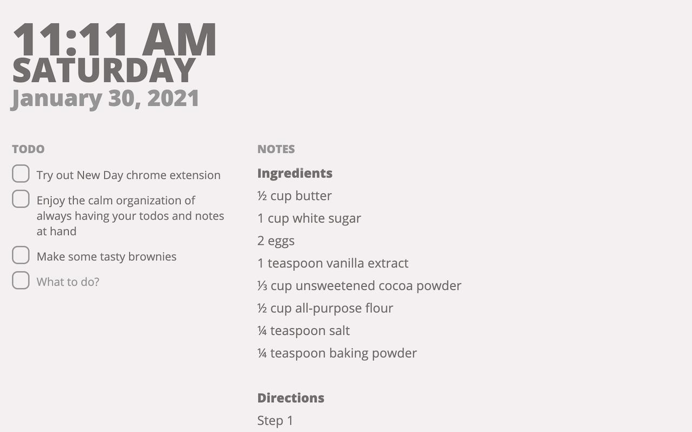

<header>

# ✨ New Day ✨
## A minimal new tab for keeping notes and staying on task.

</header>

New Day is a Chrome extension 
to keep notes, track todos, and see events
from your new tab page.

[Get it on the Chrome Store](https://example.com)

[Check out the Source Code](https://github.com/RegisFrey/NewDay)

## Privacy Policy
**The "New Day" Chrome Extension does not collect
any personal data.**

New Day stores all your information
(calendar events, todo items, notes)
on your personal computer
or in your Google Account (if Chrome sync is enabled).
We can't see or access that data at all. 

We don't send anything back to our servers
(we don't even have servers to send anything back to).

## User Agreement

By installing and using this extension you agree to this user agreement:

> THE SOFTWARE IS PROVIDED "AS IS", WITHOUT WARRANTY OF ANY KIND, 
> EXPRESS OR IMPLIED, INCLUDING BUT NOT LIMITED TO THE WARRANTIES 
> OF MERCHANTABILITY, FITNESS FOR A PARTICULAR PURPOSE AND NONINFRINGEMENT.
> IN NO EVENT SHALL THE AUTHORS OR COPYRIGHT HOLDERS BE LIABLE FOR ANY CLAIM,
> DAMAGES OR OTHER LIABILITY, WHETHER IN AN ACTION OF CONTRACT, TORT OR OTHERWISE,
> ARISING FROM, OUT OF OR IN CONNECTION WITH THE SOFTWARE OR THE USE OR OTHER
> DEALINGS IN THE SOFTWARE.

That's all caps legal terms for "we hope this extension works great for you
but don't sue us if it doesn't"

## Bug Reporting
Bugs can be reported here https://github.com/RegisFrey/NewDay/issues