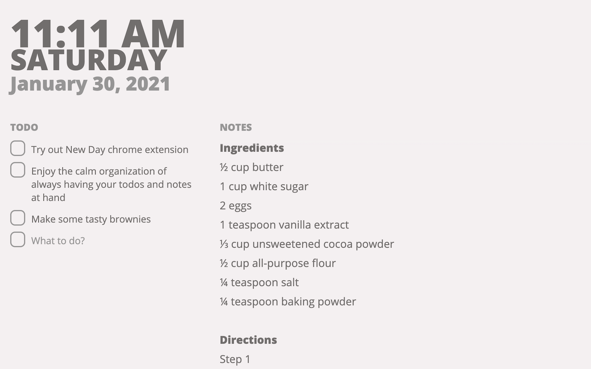

<header>

# ✨ New Day ✨
## A minimal new tab for keeping notes and staying on task.

by [Regis Frey](http://regisfrey.com)

<nav>

[Privacy Policy](#privacy-policy) | [User Agreement](#user-agreement) | [Tip Jar](https://github.com/sponsors/RegisFrey)

</nav>

</header>

New Day is a Chrome extension 
to keep notes, track todos,
and see upcoming calendar events
all from your new tab page.

[Get it on the Chrome Store](https://chrome.google.com/webstore/detail/new-day/niklocfdniincmmjabhldodncchnndac)

[Check out the Source Code](https://github.com/RegisFrey/NewDay)

## Privacy Policy

### Kinds of Data
The New Day client contains 3 kinds of personal data:
1. Todo items you create
2. Text you write in the notes area
3. Upcoming calendar events (synced from Google Calendar)
    to be shown in the "Today" column.
    *Requires optional read-only permission to access your Google Calendar.*

### Storage
New Day stores all of these
(notes, todo items, calendar events) 
**on your personal computer** or **in your Google Account** 
( [if Chrome sync is enabled](https://support.google.com/chrome/answer/185277) ).

> For the technically minded this is stored via [chrome.storage](https://developer.chrome.com/docs/extensions/reference/storage/) see the [code in storage.ts](https://github.com/RegisFrey/NewDay/blob/main/src/helpers/storage.ts)

### Usage
This data (notes, todo items, calendar events) is used only for the purpose of 
providing the features of the extension, that is:
1. To display & persist your todos.
2. To display & persist your notes.
3. To show your upcoming calendar events.

New Day's use of information received from Google APIs
(specifically Google Calendar events) adheres to the
[Google API Services User Data Policy](https://developers.google.com/terms/api-services-user-data-policy#additional_requirements_for_specific_api_scopes),
including the Limited Use requirements.

### Transfer
We don't send anything back to our servers 
(we don't even have servers to send anything back to).

### Sharing
We don't share any information with advertisers or 3rd parties 
(since we don't collect your data, we don't have any data to share).

## User Agreement

By installing and using this extension you agree to this user agreement:

> THE SOFTWARE IS PROVIDED "AS IS", WITHOUT WARRANTY OF ANY KIND, 
> EXPRESS OR IMPLIED, INCLUDING BUT NOT LIMITED TO THE WARRANTIES 
> OF MERCHANTABILITY, FITNESS FOR A PARTICULAR PURPOSE AND NONINFRINGEMENT.
> IN NO EVENT SHALL THE AUTHORS OR COPYRIGHT HOLDERS BE LIABLE FOR ANY CLAIM,
> DAMAGES OR OTHER LIABILITY, WHETHER IN AN ACTION OF CONTRACT, TORT OR OTHERWISE,
> ARISING FROM, OUT OF OR IN CONNECTION WITH THE SOFTWARE OR THE USE OR OTHER
> DEALINGS IN THE SOFTWARE.

That's all caps legal terms for "we hope this extension works great for you
but don't sue us if it doesn't"

It echoes the [MIT license we are using in the sourcecode](https://github.com/RegisFrey/NewDay/blob/main/LICENSE) 
which also gives you rights to modify and redistribute the software
with the same disclaimer of warrenty as above.

## Bug Reporting
Bugs can be reported here https://github.com/RegisFrey/NewDay/issues
